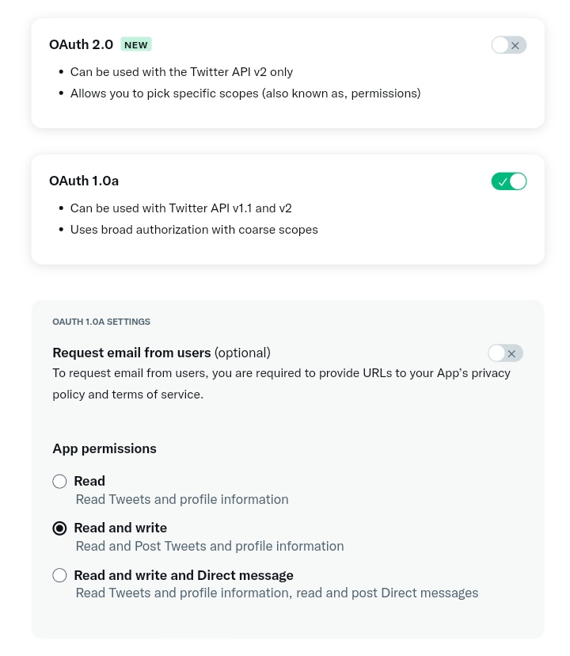
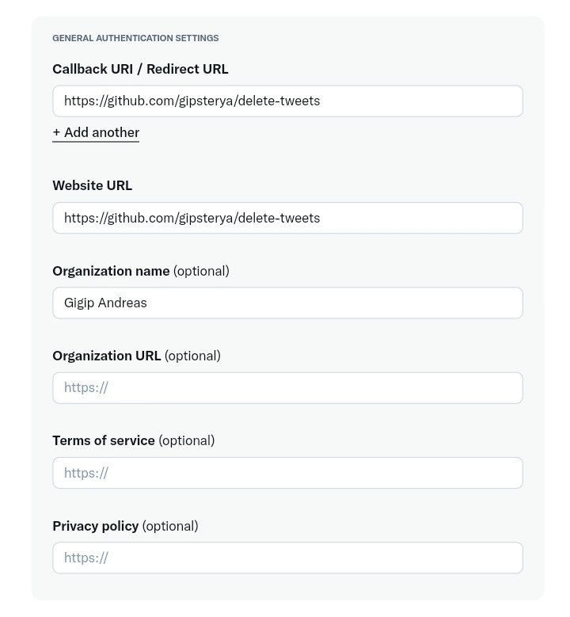
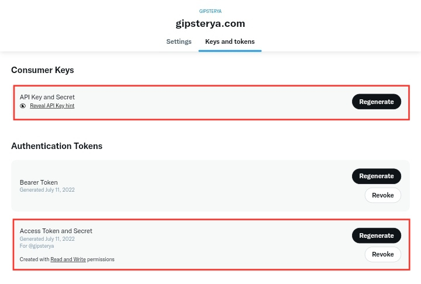

# DeleteTweets.js

<p align="center">
  
</p>

A Node.js script to delete your old tweets.

## Why?

Deleting tweets is tricky. And expensive.

If you try to delete tweets via a free third-party services, some of them will limit to delete 100 tweets per day, the other will limit access only for one last year, etc. Whatever it is, the Twitter User Timeline API itself is limited to your 3,200 recent tweets. You can't take more than that.

Now you can. And still free.

---

## Hold up!

*This script was written with the intention to be my lowest-effort (because I'm lazy) to automating the deletion of tweets. **If anything breaks, it is up to you to fix it.** Do with your own risk. You have been warned.*

---

## Usage

> **Note:** this script uses the Twitter API v1.1 which requires Elevated access. The Essential access only able to make requests to Twitter API v2.

#### Step 1

- Sign up for [Twitter Developer Account](https://developer.twitter.com/en/portal) and apply for Elevated access (by default your access is Essential)
- Create an [App on Twitter](https://developer.twitter.com/en/apps) and set the permissions to *Read and write*

  

  *In the URL section, if you didn't have any website just use this repository*

  

- Generate your Consumer Keys and Access Token

  

#### Step 2

- Request and download your [Twitter Data Archive](https://www.wikihow.com/Use-Your-Twitter-Archive-File)
- Extract the `.zip` file from your Data Archive and find `tweet.js`

#### Step 3
- Clone this repository and install dependencies

  ```
  git clone https://github.com/gipsterya/delete-tweets.git
  cd delete-tweets
  npm i
  ```
- Copy `tweet.js` from step 2 to `app` folder
- Open `config.js` and put your Twitter Keys and Token from step 1
- Set the `maxDate` (the older tweets than this date will be deleted) or left empty to use current date (delete all tweets)
  
  ```js
  {
    // Will delete your old tweets till 1 January 2020
    maxDate: '2020-01-01 00:00:00 +0000',
  }
  ```
- Set the array `saveRegExp` to exclude tweets from deleting process or left empty to delete all tweets

  ```js
  {
    // Will not delete tweets containing #twitter
    saveRegExp: ['#twitter'],
  }
  ```
- Run `npm test` to verify account (should return your username)
- Run `npm start`

Cool. Now take a coffee and watch some movie on Netflix while the script deletes your tweets. Script run every 0,5 second (120 tweets/m or 7,200 tweets/h).

Once it's done, the script will generate `log.json` in `app` folder.
